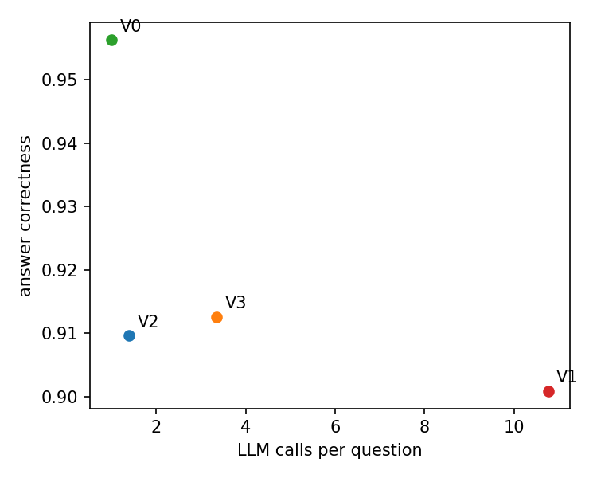
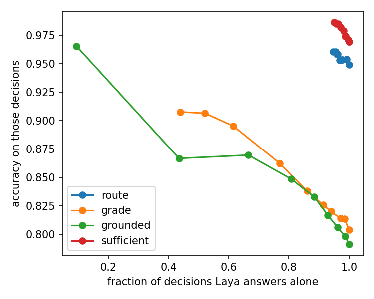

# GateKeep

An agentic RAG pipeline calls an LLM for every small judgment: is this passage relevant, is the draft grounded in it, is there enough to answer. GateKeep asks whether a small fine-tuned model, Laya (421M parameters, about 46 ms per decision), can make those calls instead, and when it should hand a decision back to the LLM. The deliverable is a measurement.

## Answer in one paragraph

A cascade that lets fine-tuned Laya decide first and asks Gemma only when Laya is unsure (V3) matches the all-LLM-gates pipeline (V1) on answer correctness: 91.3% against 90.1% on 343 held-out-chapter questions. It uses 4.7 times fewer gate-level LLM calls, which misses the 5 times target we fixed before running anything, so the pre-registered verdict is a fail. The miss is small. A lower confidence threshold passes with a wide margin: at tau 0.7 V3 is 13.7 times cheaper than V1 and matches its correctness (90.4% against 90.1%). Skipping the gates entirely (V0) gives the highest correctness of all, 95.6%, but the lowest faithfulness. The gates buy faithfulness and cost some correctness.

## Setup

**Corpus.** Géron, *Hands-On Machine Learning with Scikit-Learn, Keras and TensorFlow* (2nd edition), parsed once with Docling and cut into heading-aware chunks of at most 300 tokens (bge-small tokenizer), because Laya reads about 512 tokens and the grounding gate sees a question plus a chunk. Chapters come from the PDF bookmarks by page. The book is copyrighted, so it and everything derived from it (parsed text, chunks, questions, cached model replies, generated answers) stay out of this repository. It ships code and aggregate results only. To reproduce, bring your own copy of the PDF.

**Pipeline.** LangGraph. The router decides between retrieve, answer directly and out of scope. Retrieval takes the top 20 from a FAISS index (bge-small) and reranks to 5 with a cross-encoder. The grade gate checks each passage; if none survives, the query is rewritten and retried up to twice, then the system refuses. Gemma writes the answer. The grounded and sufficient gates check it; if either says no, it regenerates up to twice and otherwise flags the answer.

| Gate | Decision | Input |
|---|---|---|
| route | retrieve, direct or out of scope | question |
| grade | relevant or not, per passage | question and passage |
| grounded | supported by the passages or not | evidence (up to 1,200 characters) and answer |
| sufficient | answers the question or not | question and answer |

Every gate sits behind one interface, so the same pipeline runs with any backend: Gemma as an LLM judge, a TF-IDF plus logistic regression baseline, Laya zero-shot, Laya fine-tuned, or the cascade.

**Variants.** V0 has no gates. V1 uses Gemma for all gates. V2 uses fine-tuned Laya for all gates. V3 is the cascade, with one threshold per gate picked on the dev set so that Laya's accepted dev decisions match the LLM judge's dev accuracy (route 0.5, grade 0.83, grounded 0.69, sufficient 0.5).

**Models.** Gemma 4 31B writes answers and is the baseline LLM judge, so the comparison is against a realistic mid-size judge. Nemotron 3 Super labels training data and grades final answers, which keeps the grader in a different family from the writer. Nemotron 3 Ultra is used only to check Super. Laya is `convaiinnovations/laya`, typed-decisions checkpoint, fine-tuned once per gate. All calls go through Ollama Cloud and are cached; fine-tuning ran on Kaggle T4 GPUs.

**Data.** Questions are generated from chunks (single-passage and two-chapter multi-hop), and the source chunk is the gold passage. Unanswerable questions target topics absent from the book. Train, dev and test are split by chapter, never at random, because the book repeats itself. The test set has 343 questions (311 answerable, 32 unanswerable). A separate set of 80 questions written by hand is reported on its own, since it is not chapter-held-out. The dev set picks the thresholds, and the test set is read only to report numbers.

## Per-gate results

Test split, one row per backend. F1 is macro-F1, ECE is expected calibration error, and latency is the median per decision. Sample sizes: route 373, grade 963, grounded 311, sufficient 622.

| Gate | Backend | F1 | ECE | p50 ms |
|---|---|---|---|---|
| route | Gemma | 0.646 | 0.115 | 368 |
| route | TF-IDF baseline | 0.563 | 0.083 | 0.8 |
| route | Laya zero-shot | 0.602 | 0.309 | 35 |
| route | Laya fine-tuned | 0.875 | 0.050 | 46 |
| grade | Gemma | 0.825 | 0.173 | 424 |
| grade | TF-IDF baseline | 0.613 | 0.043 | 1.1 |
| grade | Laya zero-shot | 0.583 | 0.049 | 35 |
| grade | Laya fine-tuned | 0.803 | 0.077 | 47 |
| grounded | Gemma | 0.720 | 0.228 | 492 |
| grounded | TF-IDF baseline | 0.453 | 0.091 | 1.1 |
| grounded | Laya zero-shot | 0.641 | 0.037 | 36 |
| grounded | Laya fine-tuned | 0.757 | 0.032 | 47 |
| sufficient | Gemma | 0.953 | 0.047 | 555 |
| sufficient | TF-IDF baseline | 0.514 | 0.006 | 0.9 |
| sufficient | Laya zero-shot | 0.857 | 0.168 | 34 |
| sufficient | Laya fine-tuned | 0.969 | 0.009 | 46 |

Fine-tuned Laya matches or beats Gemma on route, grounded and sufficient, and is about 2 points behind on grade (accuracy 80.4% against 82.7%). It is roughly ten times faster and much better calibrated. Fine-tuning matters: zero-shot Laya is far behind on route and grade. The baseline is only competitive on latency.

Laya's weak spot is the router's out-of-scope class, where recall is 0.56. Gemma's is 0.16.

**Retrieval and reranking.** The gold passage is in the search top 20 for 94.2% of test questions and in the reranked top 5 for 91.3%. Using Laya as the reranker instead of the cross-encoder gives hit@5 of 91.6% against 91.3%, a tie.

## End-to-end results

Test set, 343 questions, with 95% bootstrap intervals. Correctness and faithfulness are graded by Super.

| Variant | Correct | Faithful | LLM calls | Gate LLM calls | Latency (s) |
|---|---|---|---|---|---|
| V0 no gates | 0.956 [0.933, 0.977] | 0.691 [0.647, 0.741] | 1.0 | 0 | 0.9 |
| V1 Gemma gates | 0.901 [0.869, 0.930] | 0.796 [0.747, 0.839] | 10.8 | 9.4 | 6.1 |
| V2 Laya gates | 0.910 [0.881, 0.939] | 0.745 [0.694, 0.793] | 1.4 | 0 | 1.2 |
| V3 cascade | 0.913 [0.883, 0.942] | 0.782 [0.730, 0.826] | 3.4 | 2.0 | 2.1 |

**Verdict.** The success criteria were fixed before any run: V3 within 2.5 points of V1 on correctness and at least 5 times fewer gate-level LLM calls. V3 is 1.2 points above V1, and the call ratio is 9.41 / 2.00 = 4.7. The verdict is a fail on cost, by a small margin.

**Threshold sweep.** The threshold affects cost much more than quality.

| tau | Correct | Faithful | Gate LLM calls | Ratio vs V1 |
|---|---|---|---|---|
| 0.7 | 0.904 | 0.783 | 0.69 | 13.7 |
| dev-picked (above) | 0.913 | 0.782 | 2.00 | 4.7 |
| 0.85 | 0.910 | 0.770 | 3.11 | 3.0 |
| 0.95 | 0.916 | 0.788 | 4.75 | 2.0 |

Tau 0.7 was tried after seeing the dev-picked result, so it is a finding and not the verdict.

**What the intervals allow.** V1, V2 and V3 overlap on correctness, so the differences among them are not established. V0 is clearly higher on correctness. The gates' gain is in faithfulness. V0's interval ([0.647, 0.741]) overlaps those of V2 and V3 and only just clears V1's, so even that gain is thin. The data does not support "gates improve quality".

**Hand-written questions** (80, reported separately):

| Variant | Correct | Faithful |
|---|---|---|
| V0 | 0.913 [0.850, 0.963] | 0.513 [0.400, 0.613] |
| V3 | 0.888 [0.813, 0.950] | 0.655 [0.517, 0.776] |

Same direction as the test set: slightly lower correctness, higher faithfulness. With 80 questions the intervals are wide.

**Grader check.** Super and Ultra give the same correctness verdict on 95.5% of 200 sampled V1 answers, so Super is a usable grader.

## Multi-agent ablation

The flat graph retries blindly. The three-agent version splits it into researcher, writer and critic subgraphs, and the critic passes its reason to the writer. The measured difference is the feedback channel plus the structure.

| Variant | Correct | Faithful | LLM calls |
|---|---|---|---|
| V1 flat | 0.901 [0.869, 0.930] | 0.796 [0.747, 0.839] | 10.76 |
| V1 agents | 0.904 [0.869, 0.933] | 0.793 [0.740, 0.839] | 10.74 |
| V3 flat | 0.913 [0.883, 0.942] | 0.782 [0.730, 0.826] | 3.36 |
| V3 agents | 0.918 [0.889, 0.948] | 0.795 [0.747, 0.840] | 3.36 |

Every difference is inside the intervals, and the call counts are the same. The agent structure and critic feedback made no measurable difference here.

## Out-of-distribution result

V1 and V3 were rerun with the book-trained gates and the same thresholds on the scikit-learn user guide (22 pages, 1,521 chunks), which none of the gates saw. The test set is 105 questions: 73 answerable and 32 unanswerable.

| Variant | Correct | Faithful | LLM calls | Gate LLM calls |
|---|---|---|---|---|
| V1 | 0.924 [0.876, 0.971] | 0.894 [0.818, 0.955] | 11.9 | 10.5 |
| V3 | 0.914 [0.857, 0.962] | 0.892 [0.815, 0.954] | 2.7 | 1.5 |

There was no drop. V3 stays within a point of V1 and uses 7.2 times fewer gate calls, above the 5 times target. Two cautions: the sample is small, and 30% of these questions are unanswerable against 9% on the book, which lifts correctness because refusing is the easy case. The honest reading is no drop on this slice, not that the gates generalize.

## Limits

- Labels for training and for the final grades come from LLMs, not people. We hand-checked 50 generated questions, and the question filters were written from that check.
- The grounded gate's training data is synthetic: a faithful answer against one with a corrupted fact. Dev and test rows use real Gemma answers labeled by Super.
- The pipeline calls its gates one after another, so cascade latency is the sum of the steps.
- Laya reads about 512 tokens and handles roughly 20 options at most, which shaped the chunk size and the evidence cap.
- Gate quality depends on models behind a free tier whose limits and versions can change. Every call is cached and the versions of the run are in `results/env.txt`.
- The scikit-learn test set is small, and its share of unanswerable questions is high.
- Prior art: Adaptive-RAG and Corrective RAG already use small classifiers as gates, and Laya ships a `LayaRouter` for LangGraph. What this project adds is a measurement on a recent model.

## Reproducing

Run the notebooks in `notebooks/` in order on Kaggle (GPU T4, internet on, an `OLLAMA_API_KEY` secret): 01 parse the corpus, 02 questions and baseline, 03 gate data, 04 fine-tune Laya, 05 main comparison, 06 verdict, sweep and grader check, 07 agents ablation, 08 out-of-distribution. Each restores the previous backup. Results are in `results/`. Run `pytest` for the unit tests.

## Credits

scikit-learn documentation © The scikit-learn developers, BSD-3-Clause. The pages are downloaded at run time and are not included here.
